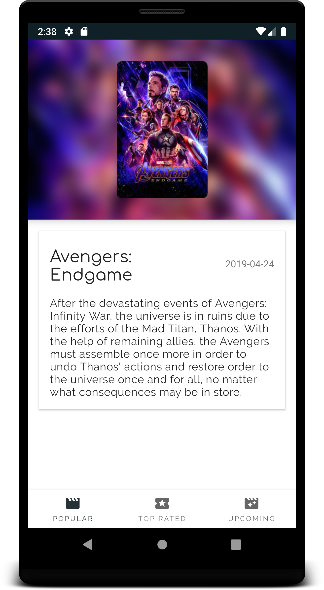

# movies-mvi

This is a sample [TMDB](https://www.themoviedb.org/) application to show what I've learned about MVI (Model View Intent) architecture pattern, applied in a clean architecture project, using [the new integration between Coroutines and Architecture Components](https://medium.com/corouteam/exploring-kotlin-coroutines-and-lifecycle-architectural-components-integration-on-android-c63bb8a9156f). 

## Dependencies

The application uses the following libraries:

* [Coroutines](https://developer.android.com/kotlin/coroutines) for concurrency
* [Koin](https://github.com/InsertKoinIO/koin) for dependency injection
* [Navigation](https://developer.android.com/guide/navigation) (Architecture component)
* [Retrofit](https://square.github.io/retrofit/) for networking
* [Timber](https://github.com/JakeWharton/timber) for logging
* [Glide](https://github.com/bumptech/glide) for loading images

## Architecture

I'm using [Clean Architecture](https://proandroiddev.com/clean-architecture-data-flow-dependency-rule-615ffdd79e29), with [Model View Intent](https://www.raywenderlich.com/817602-mvi-architecture-for-android-tutorial-getting-started) as architecture pattern. To do so, I've structured the application in different modules like the following:
* **App module:** is part of the presentation layer. It contains the application class, activities, and fragments, and set up the Koin (dependency injection) modules, so it depends on all modules.
* **Presentation module:** contains ViewModels and view state models. It depends on the domain module.
* **Domain module:** contains the use cases, actions, results, entities and repository interfaces. It has no dependency. It's the most inner part of "the onion"
* **Data module:** contains repository implementations with different data sources (local, remote, cache). In this case, I only have a remote source and a simple local cache.

## TMDB API

The app uses the https://www.themoviedb.org/ API, so you need to use your own API key. Just add your API key in the *local.properties* file like the following:

```
tmdb_api_key="your_api_key"
```

## Kotlin DSL
I've also tried using [Kotlin DSL](https://docs.gradle.org/current/userguide/kotlin_dsl.html) instead of Groovy in Gradle files. And also used the [Gradle Versions Plugin](https://github.com/ben-manes/gradle-versions-plugin) to check for available libraries updates, as Kotlin DSL Gradle files won't notify about that.

## Screenshots

 

## Useful links
* https://medium.com/corouteam/exploring-kotlin-coroutines-and-lifecycle-architectural-components-integration-on-android-c63bb8a9156f
* https://www.raywenderlich.com/817602-mvi-architecture-for-android-tutorial-getting-started
* https://medium.com/@thanh.bm/android-mvi-architecture-with-livedata-c72e9e1bd3e6
* https://proandroiddev.com/mvi-on-android-with-livedata-coroutines-d2172bc7f775
* https://proandroiddev.com/migrate-to-gradle-kotlin-dsl-in-4-steps-f3e3b27e1f4d?gi=c3816856385d

License
-------

    Copyright 2019 Juan José Granadilla Manzano

    Licensed under the Apache License, Version 2.0 (the "License");
    you may not use this file except in compliance with the License.
    You may obtain a copy of the License at

       http://www.apache.org/licenses/LICENSE-2.0

    Unless required by applicable law or agreed to in writing, software
    distributed under the License is distributed on an "AS IS" BASIS,
    WITHOUT WARRANTIES OR CONDITIONS OF ANY KIND, either express or implied.
    See the License for the specific language governing permissions and
    limitations under the License.
